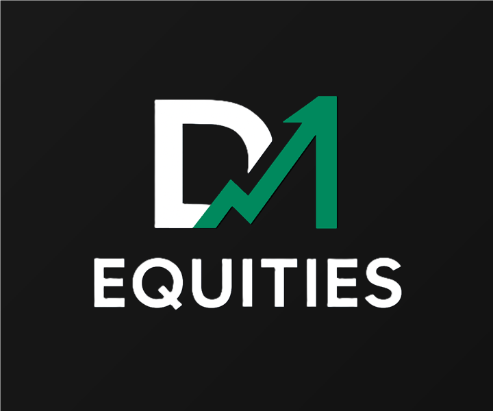
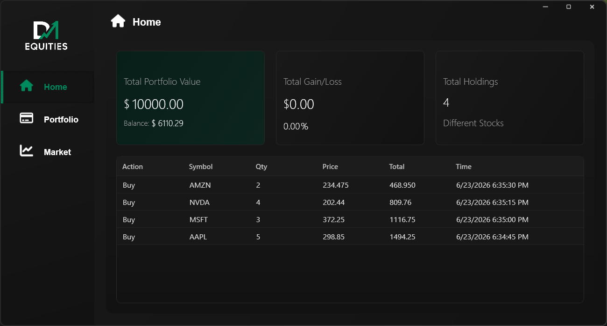
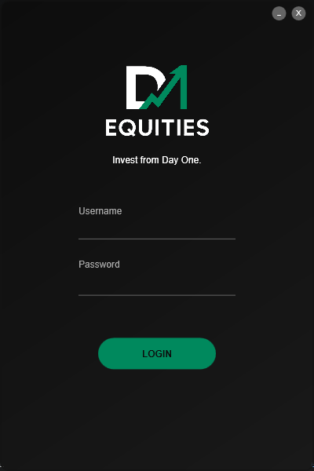
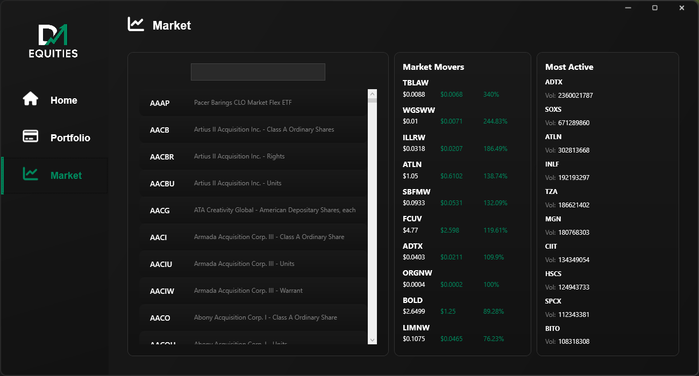
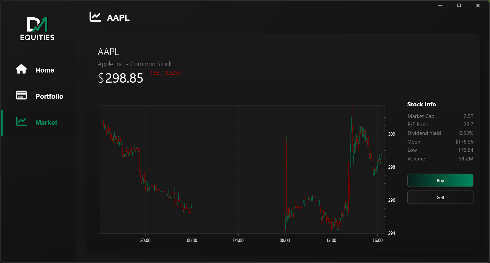
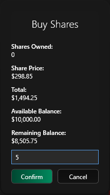
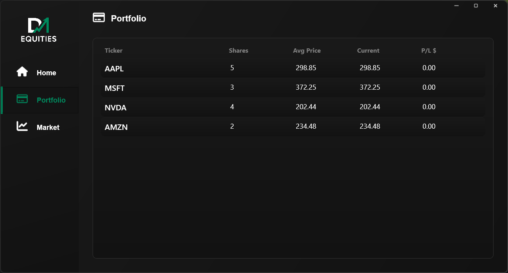

<div align="center">



# D1 Equities

### *Invest from Day One.*

En modern desktop-app för aktiehandel där du handlar på den **riktiga amerikanska börsen i realtid** – men med låtsaspengar. Öva din investeringsstrategi helt utan risk.




</div>

---

## 💡 Om projektet

**D1 Equities** är en aktiehandelssimulator byggd i **C# / .NET 8** med **WPF**. Programmet kopplar upp sig mot
den verkliga amerikanska aktiemarknaden via [Alpaca Markets API](https://alpaca.markets/) och låter dig handla bland
**över 7 000 aktier** med riktiga, löpande priser – men med ett fiktivt startkapital på **$10 000**.

Tanken är enkel: *du ska kunna lära dig handla aktier och testa strategier utan att riskera en enda krona.* Du loggar
in med ett eget konto, följer kursrörelser i realtid med candlestick-grafer, köper och säljer, och ser hur din portfölj
utvecklas över tid – precis som i en riktig handelsplattform.

> **Bra att veta:** Eftersom appen visar data från den amerikanska börsen är den som mest levande när marknaden är öppen,
> dvs. vardagar ca **15:30–22:00 svensk tid**.

---

## ✨ Funktioner

### 🔐 Inloggning
Säker inloggning med eget användarkonto. Varje användare har en egen portfölj som sparas mellan sessioner.

<div align="center">

</div>

### 🏠 Home – Din portfölj i ett ögonkast
Startvyn ger en tydlig översikt: **totalt portföljvärde**, tillgängligt **saldo**, total **vinst/förlust** i både dollar
och procent samt antalet olika aktier du äger. Längst ner finns en komplett **transaktionshistorik** över alla köp och sälj.

<div align="center">

</div>

### 📈 Market – Utforska marknaden
Sök bland **över 7 000 amerikanska aktier** på ticker eller företagsnamn. I sidopanelerna visas de **10 största
vinnarna** ("Market Movers") och de **10 mest omsatta aktierna** ("Most Active") det senaste dygnet – uppdaterat med
färsk marknadsdata.

<div align="center">

</div>

### 🕯️ Stock – Realtidskurser & candlestick-grafer
När du väljer en aktie ser du **aktuellt pris i realtid**, dagens förändring samt en interaktiv **candlestick-graf**
som ritas upp live via en WebSocket-ström. En infopanel visar nyckeltal som Market Cap, P/E-tal, utdelning, volym och
dagens öppning/lägsta.

<div align="center">

</div>

### 💵 Köp & sälj
Handelsdialogen räknar automatiskt ut totalkostnad och visar ditt saldo **före och efter** affären, så att du alltid
har full koll innan du bekräftar.

<div align="center">

</div>

### 💼 Portfolio – Dina innehav
En tydlig tabell över alla aktier du äger: antal, **genomsnittligt inköpspris (GAV)**, aktiens nuvarande pris och din
**vinst/förlust per innehav** i dollar.

<div align="center">

</div>

---

## 🛠️ Teknik & arkitektur

| Område | Teknik |
| --- | --- |
| **Språk & runtime** | C# 12, .NET 8 |
| **Gränssnitt** | WPF (XAML), custom-stylade kontroller, mörkt tema |
| **Arkitektur** | MVVM (Model–View–ViewModel) med commands & databinding |
| **Marknadsdata** | Alpaca Markets – REST (historik, screeners) + **WebSocket** (realtidspriser) |
| **Grafer** | OxyPlot (candlestick-diagram) |
| **Datahantering** | `System.Text.Json` för portföljer/användare, CsvHelper, JSON-baserad persistens |
| **Ikoner** | FontAwesome.Sharp |

**Tekniska höjdpunkter:**

- 🔄 **Realtidsdata via WebSocket** – kurser och grafer uppdateras löpande utan att appen behöver fråga om data.
- 🧱 **Renodlad MVVM-arkitektur** – tydlig separation mellan vyer, vy-modeller och affärslogik, vilket gör koden lätt att underhålla och testa.
- 🧩 **Två-projektslösning** – `D1Equities.Sim` (marknads- & portföljlogik) är frikopplat från `D1Equities.GUI` (presentationslagret).
- ⚡ **Asynkron datahämtning** – över 7 000 aktiesymboler och marknadsdata laddas parallellt med `async/await` för snabb uppstart.
- 🔐 **Säker hantering av API-nycklar** via miljövariabler (`.env`), som aldrig checkas in i versionshanteringen.

---

## 🚀 Kom igång

### Krav
- **.NET 8 SDK** eller senare
- **Windows** (WPF-applikation)
- API-nycklar från [Alpaca Markets](https://alpaca.markets/) (ett gratiskonto räcker)

### Installation

1. Klona repot och bygg projektet:
   ```bash
   git clone https://github.com/Brian-Bridgeman/D1Equities.git
   cd D1Equities/D1Equities.GUI
   dotnet build
   ```

2. Skapa en fil med namnet **`.env`** i mappen `D1Equities.GUI` med dina Alpaca-nycklar:
   ```env
   APCA_API_KEY_ID=din_nyckel_id
   APCA_API_SECRET_KEY=din_hemliga_nyckel
   ```

3. Starta appen:
   ```bash
   dotnet run
   ```
   Logga in med standardkontot (användarnamn `a`, lösenord `a`) – konton kan redigeras i `users.json`.

> 💡 Kör appen under den amerikanska börsens öppettider (ca 15:30–22:00 svensk tid) för att se priser och grafer röra sig live.

---

## 📁 Projektstruktur

```
D1Equities/
├── D1Equities.GUI/      # WPF-app: vyer, vy-modeller, stilar (presentationslager)
│   ├── View/            # XAML-vyer (Login, Home, Market, Stock, Portfolio …)
│   ├── ViewModel/       # MVVM-vy-modeller
│   └── Model/           # Användarmodell & repositories
└── D1Equities.Sim/      # Affärslogik: marknadssimulator, portfölj, positioner, API-anrop
```

---

<div align="center">

*D1 Equities byggdes som ett grupparbete under första kursen i en .NET-utbildning.*

</div>
